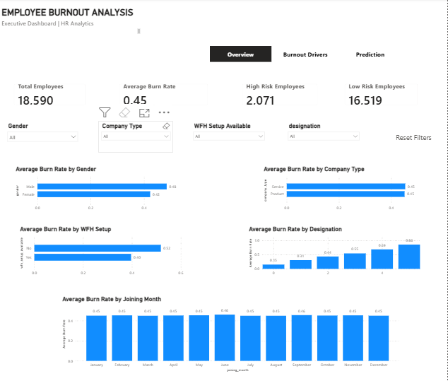
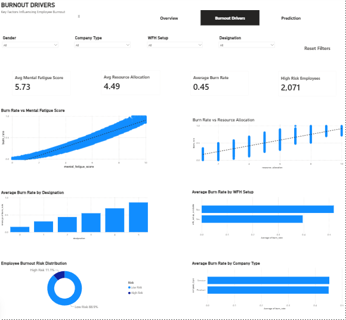

# 🔥 Employee Burnout Analysis & Prediction

## 📌 Project Overview

Employee burnout can negatively affect productivity, employee well-being, retention, and organizational performance.

This end-to-end analytics and machine learning project investigates the factors associated with employee burnout and develops a predictive approach for identifying employees at high risk of burnout.

The project demonstrates a complete analytics workflow using **PostgreSQL, Python, Machine Learning, and Power BI**, from data preparation and exploratory analysis through predictive modeling and executive dashboard development.

## 🎯 Business Question

> **What factors drive employee burnout, and can we accurately predict employees at high risk of burnout so the company can take proactive actions to improve employee well-being and productivity?**

## 🛠️ Tools & Technologies

- **PostgreSQL / SQL** — Data validation, cleaning, transformation, and exploratory analysis
- **Python** — Exploratory data analysis, statistical analysis, feature engineering, and machine learning
- **Pandas & NumPy** — Data manipulation and numerical analysis
- **Matplotlib / Seaborn** — Analytical visualizations
- **Scikit-learn** — Machine learning and model evaluation
- **Power BI** — Interactive executive dashboard and business reporting
- **GitHub** — Project documentation and version control

## 🔄 Project Workflow

1. Data validation and quality assessment
2. SQL data cleaning and transformation
3. Exploratory data analysis
4. Statistical and correlation analysis
5. Feature engineering
6. Machine learning model development
7. Model comparison and evaluation
8. High-risk employee prediction
9. Power BI dashboard development
10. Business insights and recommendations

## 🤖 Machine Learning

Multiple classification models were evaluated to identify employees at high risk of burnout.

The final predictive analysis achieved approximately:

- **Model Accuracy:** 94.02%
- **High-Risk Recall:** 95.95%

The high recall is particularly important because it reduces the likelihood of failing to identify employees who are genuinely at high risk of burnout.

## 📊 Power BI Dashboard

The Power BI solution contains three analytical pages:

### 1. Workforce & Burnout Overview



### 2. Burnout Drivers



### 3. Burnout Risk Prediction


## 📈 Key Business Findings

The analysis indicates that:

- **Mental fatigue** is the strongest driver associated with burnout risk.
- **Resource allocation/workload** is another major contributor to burnout.
- **Designation** also contributes to differences in burnout risk.
- The analysis identified **2,071 high-risk employees**, representing approximately **11.1%** of the analyzed workforce.
- Predictive modeling can support earlier identification of employees requiring intervention.

## 💡 Business Recommendations

Organizations can use these findings to:

- Monitor employees with elevated mental fatigue.
- Review workload and resource allocation for high-risk employees.
- Establish targeted employee wellness and burnout-prevention programs.
- Use high-risk predictions as an early-warning system rather than waiting for burnout to become severe.
- Track burnout KPIs through the Power BI dashboard and evaluate whether interventions reduce risk over time.

## 📁 Repository Structure

```text
employee-burnout-analysis/
│
├── data/       # Final cleaned dataset
├── sql/        # PostgreSQL analysis and data preparation
├── python/     # Python EDA and machine learning
├── charts/     # Python-generated analytical visualizations
├── powerbi/    # Power BI dashboard, PBIX file, and screenshots
└── README.md   # Project documentation
